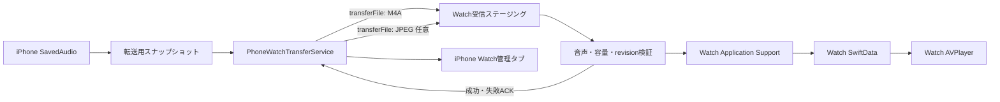

# Apple Watch対応 実装計画

## 再評価結果

Apple Watch対応は**条件付きGo**とする。

iPhoneに保存済みのM4Aを`WatchConnectivity`で転送し、Watchアプリのコンテナへ独立保存してAVFoundationで再生する構成は実現可能である。Watch側にはGoogleログイン、YouTube Data API、Python、yt-dlpを含めないため、YouTube APIクォータにも影響しない。

ただし`transferFile`は即時配送ではなく、転送時刻はOSが管理する。長尺M4Aの転送時間、Watchの空き容量、音声ルート、バックグラウンド再生はペアリング済み実機で合否を判定する。

参考:

- [Watch Connectivity](https://developer.apple.com/documentation/watchconnectivity/wcsession)
- [Transferring data with Watch Connectivity](https://developer.apple.com/documentation/watchconnectivity/transferring-data-with-watch-connectivity)
- [Playing Background Audio](https://developer.apple.com/documentation/watchkit/playing-background-audio)

## 対象範囲

- iPhoneライブラリの保存済み音声を、ユーザー操作でApple Watchへ転送する
- iPhoneに「Watch」管理タブを追加する
- Watch側に転送済みライブラリ一覧とローカルプレイヤーを追加する
- 転送、キャンセル、失敗、再試行、Watch保存確認、Watchからの削除を管理する
- Watch側で再生位置を復元し、バックグラウンド再生する

初期PoCでは次を対象外とする。

- Watch単体でのYouTube検索、ログイン、音声抽出
- ストリーミング再生
- 複数Watch間での同時ライブラリ管理
- iPhoneとWatchの再生位置の自動統合
- Watchのコンプリケーション、Widget、CarPlay連携
- YouTubeアカウントの視聴履歴タブ

## 実装状況（2026-08-16）

- Watchアプリのローカルライブラリ、音声プレイヤー、受信ステージング、検証、ACK outbox、inventory、削除commandを実装済み
- iPhoneライブラリにWatch転送／キャンセル／再試行／削除操作を追加し、ライブラリ右側にWatch管理タブを実装済み
- Watch inventoryはiPhoneで永続cursorと照合し、古いinstance／generation、identity不一致、サイズ不一致、遅延ACKによる状態復活を拒否する
- iPhoneの手動再同期はrequest IDを送信前に永続化したlatest-wins application contextで要求し、Watchは各同期passでcurrent contextを再読して相関付きfresh inventoryを返す
- Google未ログイン時も、iPhoneの保存済みライブラリとWatch管理タブだけを利用できる
- Simulatorの自動回帰はiOS 149件（ネットワーク4件スキップ）とWatch 120件が成功
- WatchConnectivityの実配送、長尺転送、Bluetooth音声、画面消灯後の再生はペアリング済み実機で未検証

## 全体構成



### 基本原則

- 大きな音声は`sendMessage`ではなく`WCSession.transferFile`を使う
- `isReachable`を転送条件にしない。必要条件はセッション`.activated`、ペアリング済み、Watchアプリ導入済み
- iPhone側は一度に1音声だけ転送し、大量のM4Aをまとめてキューへ投入しない
- iPhone側の送信完了だけでは「Watch保存済み」にしない
- Watchが保存・検証を終えてACKを返した時点で転送完了とする
- iPhoneとWatchは別端末のため、App Groupで音声やSwiftDataを直接共有しない

## 転送プロトコル

### 転送単位

1音声につき、同じ`transferID`と`revision`を持つ最大2ファイルを送る。

1. 必須: `<transferID>.m4a`
2. 任意: `<transferID>.jpg`として縮小したサムネイル

音声と画像の`metadata`にはProperty List互換値だけを入れる。

- schema version
- transfer ID
- monotonically increasing revision
- file kind (`audio` / `artwork`)
- YouTube ID
- タイトル、チャンネル名、公開日時
- 再生時間、保存時視聴回数、ファイルサイズ
- 転送開始時の再生位置

サムネイルは任意とし、音声の保存成功を再生可能の条件にする。画像転送に失敗してもWatchではプレースホルダーを表示し、音声は利用できる。

### iPhone側

- 元M4Aを直接キューへ渡さず、`Application Support/WatchTransfers/<transferID>/`へ転送用スナップショットを作る
- 転送中にiPhoneライブラリから元音声が削除されても転送を壊さない
- `WCSessionFileTransfer.progress`を監視してUIへ進捗を反映する
- キャンセル時は同じ`transferID`の未完了音声・画像転送を両方キャンセルする
- `didFinish`成功後は「Watch取込確認待ち」とし、Watch ACKを待つ
- アプリ再起動時は`outstandingFileTransfers`と永続レコードを照合して状態を復元する
- 一時的な通信失敗は最大2回だけ自動再試行し、その後は手動再試行にする

### Watch側

受信したURLは一時ファイルであり、delegate callback終了後に削除される。`session(_:didReceive:)`内で同期的にWatch側のステージング領域へ移動する。

移動後は非同期に次を処理する。

1. schema、transfer ID、YouTube ID、file kind、revisionを検証
2. 古いrevisionや削除済みrevisionを拒否
3. 拡張子と宣言サイズを検証
4. AVFoundationで音声トラックがあり、動画トラックがないことを検証
5. Watchの空き容量を検証
6. `Application Support/WatchLibrary/Audio`へatomic move
7. SwiftDataを保存
8. iPhoneへ成功または失敗ACKを`transferUserInfo`で返す

受信ファイルをcallback内で移動する必要性はApple公式にも明記されている。[session(_:didReceive:)](https://developer.apple.com/documentation/watchconnectivity/wcsessiondelegate/session(_:didreceive:))

### 削除と遅延配送

- iPhoneからWatch削除を要求する場合は、revision付きの永続的な削除命令を送る
- Watchは削除済みrevisionを記録する
- 削除命令より古い音声が遅れて届いても復活させない
- Watch側で再生中の音声を削除する場合は、先に停止してプレイヤーUIを閉じる
- 削除ACK後にiPhoneの管理レコードを更新する

## データモデル

### iPhone: `WatchTransferRecord`

`SavedAudio`とはSwiftDataリレーションを張らず、YouTube IDで関連付ける。これによりiPhoneの元音声を削除した後も、Watch上のコピーを管理できる。

主な項目:

- YouTube ID、タイトル、チャンネル、再生時間
- transfer ID、revision
- state raw value
- progress（永続化は節目だけ）
- queuedAt、transferredAt、lastConfirmedAt
- Watch上のファイルサイズ
- 最後のエラーコードと表示メッセージ
- automatic retry count

状態:

- `notTransferred`
- `preparing`
- `queued`
- `transferring`
- `awaitingWatchConfirmation`
- `availableOnWatch`
- `cancelling`
- `deletionPending`
- `failed`
- `reconciliationRequired`

既存リリースの`SavedAudio`ストアはVersionedSchema情報を持たない。Xcode 27ではこの実ストアを後付けの段階移行で開くと`unknown model version`になることを確認したため、Watchモデル追加時は未versionedの複合Schemaによる推論軽量migrationを使う。旧ストアを実際に作成して全フィールド保持を検証し、失敗時にストア削除へフォールバックしない。VersionedSchemaへの切り替えは、既存ストアを安全にbootstrapする専用移行を用意できた段階で別途行う。

### Watch: `WatchSavedAudio`

- YouTube ID、タイトル、チャンネル、公開日時、視聴回数
- 再生時間、音声・サムネイル相対パス、ファイルサイズ
- receivedAt、revision
- lastPlaybackPosition、hasBeenPlayed

Watchの在庫一覧はapplication contextでiPhoneへ返し、ACK欠落やWatch切替後の状態を再照合する。

## iPhone UI

### ライブラリカード

再生履歴フッター右側の表示順を固定する。

```text
前回 08:15       [Watch転送] [再生中／一時停止] [42%]
────────────────────────────────────────────
```

- 転送ボタンは再生中・一時停止バッジの左に配置
- シーク履歴バーの右上側へ視覚的に寄せるが、負のoffsetでカード外へ出さない
- 未再生項目にも転送ボタンを表示する
- 転送中は円形進捗とキャンセル操作
- 転送済みは`Apple Watch + checkmark`
- 失敗は警告アイコンと再試行
- 未ペアリング／Watchアプリ未導入はdisabledにせず、理由を説明するsheetを表示
- VoiceOverで転送状態、進捗、操作結果を独立して読み上げる

現在のカード全体は`Button`なので、内部へ転送`Button`を直接ネストしない。カードの再生操作と転送操作を兄弟要素へ分離し、タップ領域とアクセシビリティアクションを個別に持たせる。

### タブ構成

認証中は次の4タブにする。

1. ホーム
2. 登録チャンネル
3. ライブラリ
4. Watch

Watchタブには次を表示する。

- ペアリング、Watchアプリ、セッション状態
- キュー待ち・転送中
- Watch保存済み一覧
- キャンセル、再試行、Watchから削除
- 最終同期日時と再同期

Google認証失敗時のオフラインモードでも、ローカルライブラリとWatch管理は利用可能にする。

## Watchアプリ

watchOS 27向けの軽量SwiftUIターゲットとして追加する。

### ライブラリ

- 転送済み音声だけを新しい順に表示
- 縮小サムネイル、タイトル、チャンネル、再生時間、再生位置
- 空一覧、受信処理中、容量不足、破損ファイルを個別表示
- スワイプまたはcontext menuで削除

### プレイヤー

- `AVPlayer`によるローカルM4A再生
- 再生、一時停止、15秒戻し／送り、シーク
- 再生位置の復元
- 次／前項目
- 画面消灯後のバックグラウンド再生
- Digital CrownとDynamic Typeを考慮したwatchOS向けレイアウト

WatchターゲットへAudio Background Modeを追加し、`AVAudioSession`を`.playback`、`.longFormAudio`で設定する。再生開始時の音声ルート選択失敗は専用エラーとして表示する。

Watch側にはGoogleSignIn、PythonKit、CPython、yt-dlp、YouTube APIクライアントをリンクしない。

再生位置はPoCではiPhoneとWatchで別管理にする。双方向同期は競合解決が必要なため、初期スコープへ含めない。

## コード変更案

### 既存ファイル

- `project.yml`
  - watchOS 27アプリ、Watch単体テスト、iOSへのWatchアプリ埋め込みを追加
- `YouTubePod/Domain/Protocols.swift`
  - `WatchTransferManaging`追加
- `YouTubePod/Services/Library/AudioLibraryService.swift`
  - 安全な転送スナップショット作成API追加
- `YouTubePod/Views/LibraryView.swift`
  - 転送ボタン、状態、進捗、キャンセル、再試行追加
- `YouTubePod/Views/RootView.swift`
  - `.watchLibrary`タブとオフライン時のローカルタブ構成追加
- `YouTubePod/App/AppEnvironment.swift`
  - `PhoneWatchTransferService`の生成と起動
- `YouTubePod/App/YouTubePodApp.swift`
  - 既存未versionedストアと互換な複合Schemaへ`WatchTransferRecord`追加

### 新規ファイル候補

- `Shared/WatchTransferEnvelope.swift`
- `YouTubePod/Domain/WatchTransferRecord.swift`
- `YouTubePod/Services/Watch/PhoneWatchTransferService.swift`
- `YouTubePod/Views/WatchLibraryView.swift`
- `YouTubePodWatch/App/YouTubePodWatchApp.swift`
- `YouTubePodWatch/Domain/WatchSavedAudio.swift`
- `YouTubePodWatch/Services/WatchSessionReceiver.swift`
- `YouTubePodWatch/Services/WatchAudioLibraryService.swift`
- `YouTubePodWatch/Services/WatchAudioPlayerService.swift`
- `YouTubePodWatch/Views/WatchLibraryView.swift`
- `YouTubePodWatch/Views/WatchPlayerView.swift`
- `YouTubePodWatch/Info.plist`
- `YouTubePodWatch/YouTubePodWatch.entitlements`
- `YouTubePodWatchTests/*`

WatchConnectivity delegateはバックグラウンドスレッドで呼ばれるため、delegate bridgeとactor／MainActorの境界を明示する。Watch側のConnectivity background taskは必ず完了させる。

## 実装フェーズ

### Phase 0: ターゲットと技術スパイク

- watchOS 27ターゲットを作成し、iOSアプリへ埋め込む
- iPhone／Watch両側でWCSessionをactivate
- 1本の短いM4Aを`transferFile`で送る
- Watch callback内で同期moveし、AVFoundation検証後に再生する
- Watch ACKがiPhoneへ戻ることを確認

この段階をGo／Blockゲートとする。

### Phase 1: 転送基盤

- versioned envelope、revision、転送スナップショット
- 永続キュー、状態遷移、進捗、キャンセル、再試行
- Watch側SwiftData、atomic import、ACK、在庫照合
- 容量不足と破損ファイル処理

### Phase 2: iPhone UI

- ライブラリカードの転送ボタン
- Watch管理タブ
- オフラインモードからの転送・管理
- 削除確認と状態別エラー表示

### Phase 3: Watch UIとプレイヤー

- ライブラリ一覧
- フルプレイヤー
- 再生位置保存、削除、バックグラウンド再生
- VoiceOver、Dynamic Type、Reduce Motion

### Phase 4: Hardening

- アプリ／端末再起動
- 転送中の通信切断
- Watch切替
- 長尺、容量不足、複数キュー
- stale revision、重複ACK、遅延配送

## テスト計画

### 単体・スタブ

- envelope encode/decode、schema不一致
- 状態遷移、重複転送抑止、進捗、キャンセル、再試行
- sender `didFinish`とWatch ACKの分離
- 再起動後のoutstanding transfer復元
- stale revision、削除後に届いた古いファイルの拒否
- 容量不足、破損M4A、音声トラックなし、動画トラックあり
- Watch削除の冪等性
- 再生位置、シーク、完了、再起動復元
- 再生中ファイル削除時の停止
- Watch切替時の在庫再照合

### ペアリング済み実機

- 通常動画、Shorts、30分以上を各1本転送
- iPhone／Watchアプリが前面にない状態で配送完了
- 転送中キャンセルと再試行
- iPhone機内モードでWatchローカル再生
- Watch再起動後の一覧、画像、再生位置復元
- Bluetoothヘッドホンで画面消灯後も再生継続
- 容量不足で既存ライブラリを壊さない
- Watch削除後に音声、画像、SwiftDataがすべて消える
- iPhoneの元音声削除後もWatchコピーを再生できる

WatchConnectivityのファイル受信はSimulatorでは最終検証できないため、ペアリング済みiPhone／Apple Watchを必須とする。

## 合格条件

### 技術スパイクGo

- 1本の公開動画由来M4AをWatchへバックグラウンド転送できる
- Watchで音声のみと検証し、ローカル再生できる
- iPhoneがWatch ACKを受け、状態を「保存済み」にできる
- iPhone／Watchアプリを閉じても転送が継続または再開する

1項目でも成立しなければ、UI本実装前にBlockとする。

### MVP Go

- 3種類の音声を転送、再生、キャンセル、再試行、削除できる
- 転送とWatch保存状態が再起動後も一致する
- 画面消灯後も再生が継続する
- 受信途中、一時ファイル、削除済み音声が残らない
- Dynamic Type、VoiceOver、ダークモードで主要操作が欠けない

## 主要リスク

- 配送時刻はOS管理であり、即時転送を保証できない
- 現行実機サンプルには約65MBの長尺M4Aがあり、転送時間とWatch容量の実測が必要
- Watchの空き容量は音声取込直前にWatch内だけで確認し、Required Reason API E174.1の用途に限定して取得値をinventoryやiPhoneへ自動送信しない
- 音声ルートが利用できない場合、再生開始に失敗する
- 複数WatchのAuto Switchで、iPhone側の「転送済み」状態が現在のWatchと一致しなくなる
- SwiftDataモデル追加前にmigrationを整備しないと、既存ライブラリを失うリスクがある
- iPhone／Watch各バンドルへ`PrivacyInfo.xcprivacy`を同梱し、Required Reason API宣言をCIで継続監査する

PoCは「現在アクティブな1台のApple Watch」「直列転送」「WatchとiPhoneの再生位置は別管理」に限定して開始する。
